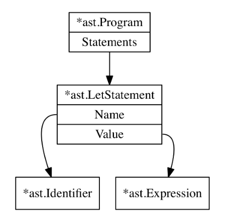
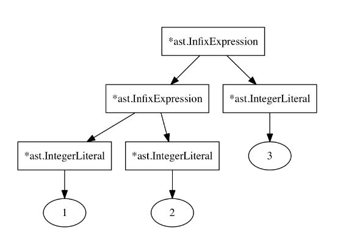

# Go Concepts
Repo for basic tutorial-based Golang study  

---

# monkey
... programming language

### run
* test module -> `go test ./interpreter/lexer`

### basics
* `compiler` -> parses source code and produces something (output in machine language)
* `interpreter` -> parses source code and doesn't produce antything
	* really simple, don't even bother parsing -> brainfuck
	* tree-walking -> produce AST and evaluate it
	* more complex, like JIT -> get internal representation and then execute on-the-flight
	* `lexer`
	* `parser`
	* tree representation
	* `evaluator`

### lexer
* source code -> tokens
* call `NextToken()` until finished (EOF??)

### parser
* produces `AST` (Abstract Syntax Tree)
* it's *abstract* because not all characters from source code go into the tree
* `CFG` (Context Free Grammar) -> set of rules which describes how to form a correct sentence in given language
* `BNF` (Backus-Naur Form) and `EBNF` (Extended Backus-Naur Form) are notations to represent CFG
* you can generate parser automatically, using definitions above
* `top-down` parsing or `bottom-up` parsing strategies exist, the one written in this exercise will be `top down operator precedence` or `Pratt parser`
* `expression` (produces value) != `statement` (doesn't produce value)
* for example (very basic) this piece of code:  
```monkey
let x = 5;
```  
is represented as:  

* `expression parsing` is likely the most complicated
* nearly all parser share *assertions functions*, which are used to enforce correct order of tokens, so that they make sense, e.g.
```go
func (p *Parser) expectPeek(t token.TokenType) bool {
	if p.peekTokenIs(t) {
		p.nextToken()
		return true
	} else {
		return false
	}
}
```  
* in `monkey` there are only 2 statements: `let` and `return`
* ... but much more expressions
	- `prefix` (e.g. `-5`)
	- `infix` (e.g. `5 + 5`)
	- `postfix` (e.g. `5++`)
	- `call expression` (e.g. `add(1, 2)`)
	- ... 
* `parseExpression` method is recursive, because expressions can be nested, which is the clou of the whole parser idea (*recursive descent parser*)
* `Top Down Operator Precedence` by V.Pratt [link](https://tdop.github.io/), but with differences:
	* `nuds` (null denotation) -> `prefixParseFns`
	* `leds` (left denotation) -> `infixParseFns`
* challenge is, to nest the nodes in AST correctly, so that 
```math
1 + 2 + 3
```  
which *mathematically* is
```math
((1 + 2) + 3)
```  
is represented as: 
  


### repl
* `REPL` - `Read-Eval-Print Loop`
* sometimes - 'console', 'interactive mode', etc.

### further (possible) exercises
- [ ] fully support Unicode in Monkey (as of now, it's only ASCII)
